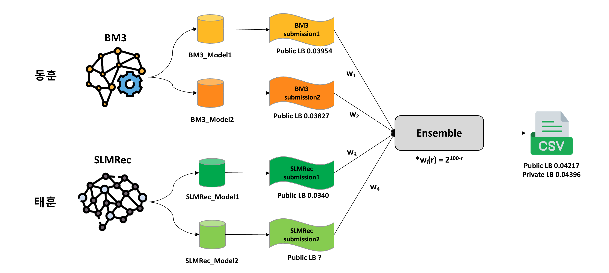

# 2023 인하 인공지능 챌린지

## [주제]
- 멀티모달 데이터 기반 추천시스템 (Multi-modal Recommender System)

## [대회설명]
- 추천 시스템은 사용자의 정보를 분석하여 사용자에게 적합한 상품을 추천해주는 인공지능 기술 중 하나입니다.

  추천 시스템 기술을 통해 사용자 편의성 증가 및 사용자의 상품의 접근성을 높여 기업의 이익 증대를 기대 할 수 있습니다.

- 추천 시스템은 주로 사용자의 상품에 대한 선호도 정보를 사용하지만,

  데이터 수집의 어려움으로 Data Sparseness나 Cold Start 문제가 발생합니다. 

  이를 보완하고자, 최근 사용자 로그 정보 뿐만 아니라 이미지 혹은 리뷰 정보를 결합하여 

  Multi-modal 데이터 기반 추천 시스템 연구가 다수 진행되고 있습니다.

- 인하대학교 인공지능융합연구센터에서는 본 챌린지를 통해 

  다양한 Multi-modal 데이터를 기반으로 높은 성능의 추천 알고리즘을 개발하는 것을 목표로 합니다.

- Multi-modal 데이터 기반의 고성능 추천 알고리즘 개발을 통해 

  추천 시스템의 한계를 극복하고 사용자에게 최적화된 개인화 추천 경험을 제공하는 것을 기대합니다.

## 대회
[Dacon Inha AI Challenge 2023](https://dacon.io/competitions/official/236113/overview/rules)

# Method

## Model
- ### [BM3](https://arxiv.org/pdf/2207.05969.pdf)
    hyperparameter
    | Embedding | n_layers | dropout | reg_weight | cl_weight | learning_rate |
    |------|------|------|------|------|------|
    |512|1|0.3|0.01|2.0|0.001|
    
    Best public LB : 0.03954

- ### [SLMRec](https://ieeexplore.ieee.org/document/9811387)
    hyperparameter
    | recdim | layer_num | ssl_task | reg | ssl_alpha | ssl_temp | dropout | learning_rate |
    |----|----|----|------|----|----|----|----|
    |64|3|FAC|0.01|0.01|1.0|0.3|0.0001|
    |64|3|FAC|0.0001|0.01|1.0|0.3|0.0001|

    Best public LB : 0.0340

## Ensemble
- method : weighted voting\
- Rank weight : $2^{100-rank}$
### Final Result
| public LB | private LB |
| --------- | ---------- |
| 0.04217 | 0.04396 |

# 대회 결과
### 전체 2위, 대학원생 트랙 1위 달성 (대상 수상)
### Team [ Medical AI Lab. ](https://hglee6.wixsite.com/inha-mai)

# How to run model
## BM3
python src/main.py -d [dataset name] -m BM3

## SLMRec
python src/main.py -d [dataset name] -m SLMRec

